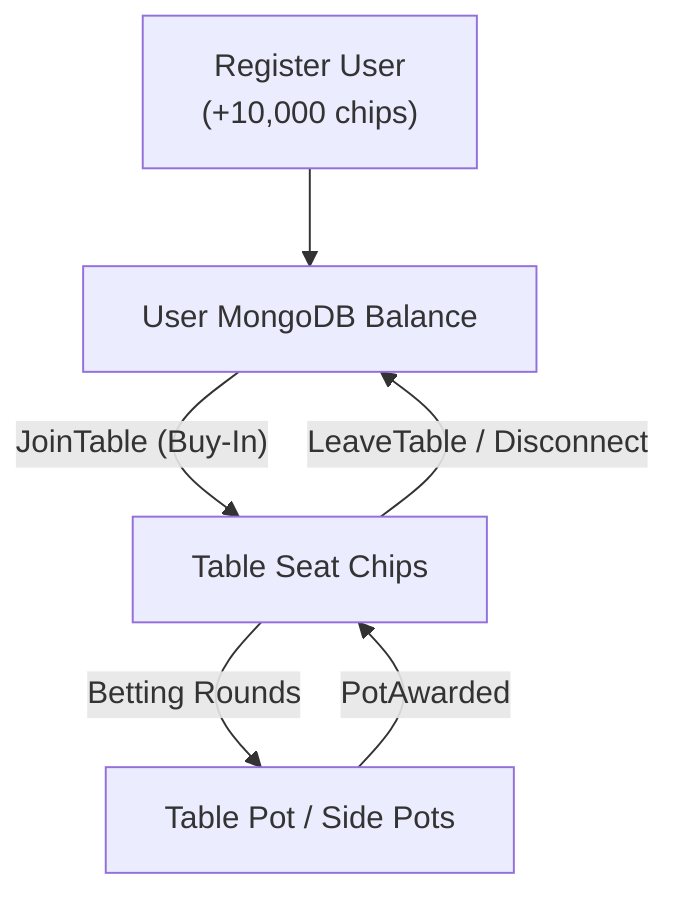

# Database & Persistence

Poker Backend uses **MongoDB** as its persistent data store, organizing data into collections for user authentication, account balances, and historical hand auditing.

---

## MongoDB Collections

| Collection | Model Struct | Description |
|------------|--------------|-------------|
| `users` | `UserDoc` | Stores user profiles, password hashes, and available chip balances |
| `hand_history` | `HandHistoryDoc` | Complete historical audit records for finished hands |

---

## 1. `users` Collection

Stores registered players and their available wallet balances.

### Document Schema
```json
{
  "_id": { "$oid": "65b8f1a23c4d5e6f7a8b9c0d" },
  "username": "alice",
  "password_hash": "$2b$12$e8x... (bcrypt hash)",
  "chips": 10000,
  "created_at": { "$date": "2026-09-27T10:00:00.000Z" }
}
```

### Field Definitions
- `_id`: Unique MongoDB `ObjectId`.
- `username`: Case-sensitive user handle.
- `password_hash`: Bcrypt hashed password string (`DEFAULT_COST = 12`).
- `chips`: Current uncommitted chip balance stored as 64-bit integer.
- `created_at`: UTC timestamp of account creation.

### Indexes
- **`username` (Unique)**:
  ```javascript
  db.users.createIndex({ "username": 1 }, { unique: true })
  ```
  Enforced automatically on application startup by `ensure_indexes()`.

---

## 2. `hand_history` Collection

Persisted automatically whenever a hand concludes (`HandEnded`).

### Document Schema
```json
{
  "_id": { "$oid": "65b8f2b34d5e6f7a8b9c0d1e" },
  "table_id": "8b51d8b7-6cb5-4f46-95fa-d4b533cb18df",
  "hand_number": 42,
  "players": [
    {
      "user_id": "65b8f1a23c4d5e6f7a8b9c0d",
      "username": "alice",
      "seat": 0,
      "starting_chips": 1000,
      "ending_chips": 1120
    },
    {
      "user_id": "65b8f1a23c4d5e6f7a8b9c0e",
      "username": "bob",
      "seat": 1,
      "starting_chips": 1000,
      "ending_chips": 880
    }
  ],
  "events": [
    {
      "HandStarted": {
        "hand_id": 42,
        "button": 0,
        "small_blind": 10,
        "big_blind": 20
      }
    },
    {
      "BlindPosted": {
        "player_id": 0,
        "amount": 10,
        "is_small_blind": true
      }
    }
  ],
  "created_at": { "$date": "2026-09-27T10:05:00.000Z" }
}
```

### Field Definitions
- `table_id`: UUID string of the table where the hand took place.
- `hand_number`: Monotonically increasing hand counter on that table.
- `players`: Array of player snapshots recording each participant's:
  - `user_id`: MongoDB user ID string.
  - `username`: Account name.
  - `seat`: Table seat index.
  - `starting_chips`: Chip balance before hand began.
  - `ending_chips`: Chip balance after hand ended.
- `events`: Array of all raw poker engine events that occurred during the hand.
- `created_at`: UTC timestamp when the hand concluded.

---

## 3. Chip Lifecycle & Conservation

The server guarantees mathematical chip conservation at all times:



1. **Account Registration**: User starts with 10,000 chips in MongoDB.
2. **Table Join**: When joining with `buy_in: X`, `X` is immediately deducted from MongoDB and credited to `table.engine.seats[seat].chips`. If seating fails, `X` is immediately refunded.
3. **Gameplay**: Chips circulate between players and pots on the table engine without touching the database, guaranteeing zero latency during betting.
4. **Table Leave / Disconnect**: When leaving a table (or on connection drop), the player's remaining table chips are credited back to MongoDB.
