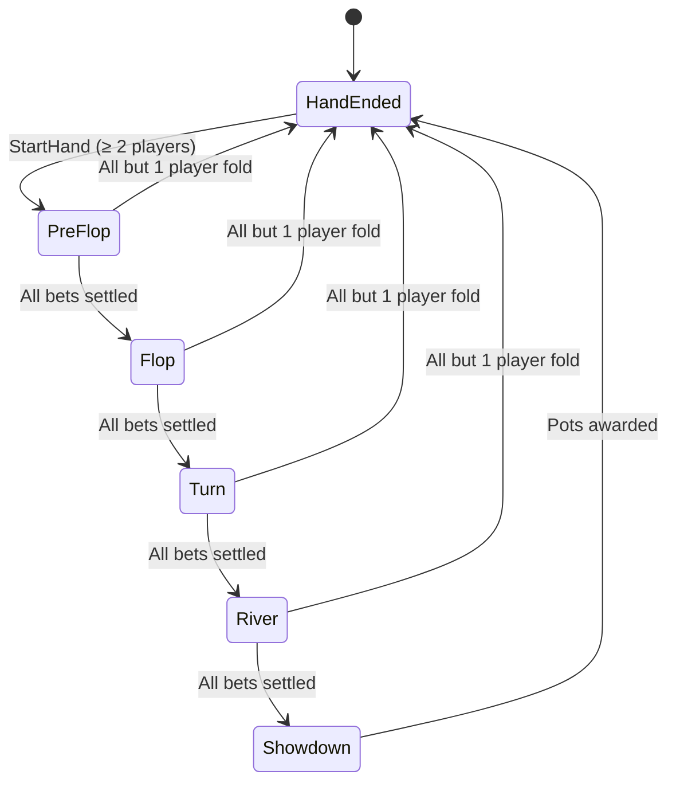

# Game Flow & Rules

This guide explains how poker gameplay is structured on the server, detailing the No-Limit Texas Hold'em (NLHE) state machine, blind postings, button rules, side-pot calculations, and disconnect handling.

---

## 1. Texas Hold'em Stage Lifecycle

A single hand progresses through standard poker betting rounds:



1. **Pre-Flop**:
   - Blinds and optional antes are posted automatically.
   - 2 hole cards are dealt privately to each active player (`HoleCards`).
   - The first player to act is prompted with `YourTurn`.
2. **Flop**: 3 community board cards are dealt.
3. **Turn**: 1 additional community board card is dealt (total 4).
4. **River**: 1 final community board card is dealt (total 5).
5. **Showdown**:
   - Hands are revealed (`Showdown` event).
   - Best 5-card hands out of 7 cards (2 hole + 5 community) are evaluated using Cactus Kev rank tables.
   - Pots and side pots are awarded to the winners (`PotAwarded`).
6. **Hand Ended**:
   - `HandEnded` event is broadcast.
   - Hand history is automatically written to MongoDB.
   - Disconnected players are cleaned up and their remaining chips refunded to MongoDB.

---

## 2. Button and Blind Rules

### Standard Multi-Way (3+ Players)
- **Dealer Button (`D`)**: Moves clockwise to the next seated player with chips each hand.
- **Small Blind (`SB`)**: Seat immediately clockwise from the button.
- **Big Blind (`BB`)**: Seat immediately clockwise from the Small Blind.
- **Action Order**:
  - Pre-Flop: Starts at "Under the Gun" (seat clockwise from the Big Blind).
  - Post-Flop (Flop, Turn, River): Starts at the Small Blind (first active player clockwise from the button).

### Heads-Up (2 Players)
In heads-up play, standard official poker rules apply:
- The **Button** posts the **Small Blind** and acts **first** pre-flop.
- The other player posts the **Big Blind** and acts **last** pre-flop.
- Post-flop, the Big Blind acts first, and the Button acts last.

---

## 3. Betting Mechanics

- **No-Limit**: A player may bet any amount up to their total chip stack.
- **Min Raise**:
  - The minimum raise must be at least the size of the previous bet/raise increment in the current betting round.
  - Exception: A short-stacked player going all-in for less than a full raise ("under-raise"). Under-raises do not reopen the action for players who have already acted facing the prior bet size.
- **Uncalled Bets**: If a player bets or raises and all opponents fold, the uncalled portion of the bet is refunded before the main pot is awarded.

---

## 4. Side Pots and All-In Resolution

When multiple players go all-in with unequal chip stacks, the server calculates main and side pots automatically:
- Each pot maintains a separate set of eligible players.
- Pots are evaluated in reverse order (side pots first, then main pot), ensuring short-stacked all-in players only win chips from players who contributed to their pot level.

---

## 5. Disconnect & Timeout Behavior

To prevent games from hanging when players lose connection:
1. **Disconnected Acting Player**: If a player disconnects and it is their turn to act:
   - If checking is legal (`can_check: true`), the server automatically applies `Check`.
   - If facing a bet (`can_check: false`), the server automatically applies `Fold`.
2. **Table Seat Cleanup**:
   - When a hand finishes, any players whose WebSocket connection is closed are removed from their seats.
   - Their remaining table chips are safely added back to their MongoDB user account.

---

## 6. End-to-End Example Session

### Alice (Seat 0, 1000 chips) vs Bob (Seat 1, 1000 chips)

```
Alice                              Server                             Bob
  │                                  │                                 │
  │─── JoinTable(seat 0, 1000) ────>│                                 │
  │<── JoinedTable(seat 0) ──────────│                                 │
  │<── TableState(...) ──────────────│                                 │
  │                                  │                                 │
  │                                  │<─── JoinTable(seat 1, 1000) ────│
  │<── PlayerJoined(Bob, 1000) ──────│─── JoinedTable(seat 1) ────────>│
  │                                  │─── TableState(...) ────────────>│
  │                                  │                                 │
  │─── StartHand ───────────────────>│                                 │
  │<── HoleCards(["A♠", "K♠"]) ──────│─── HoleCards(["Q♦", "J♦"]) ────>│
  │<── GameEvent(HandStarted) ───────│─── GameEvent(HandStarted) ─────>│
  │<── GameEvent(BlindPosted SB:10) ─│─── GameEvent(BlindPosted SB:10)─>│
  │<── GameEvent(BlindPosted BB:20) ─│─── GameEvent(BlindPosted BB:20)─>│
  │<── YourTurn(can_call, can_raise)─│                                 │
  │                                  │                                 │
  │─── PlayerAction(Raise to 60) ───>│                                 │
  │<── GameEvent(PlayerActed) ───────│─── GameEvent(PlayerActed) ─────>│
  │                                  │─── YourTurn(can_call, can_raise)─│
  │                                  │                                 │
  │                                  │<─── PlayerAction(Call) ─────────│
  │<── GameEvent(PlayerActed) ───────│─── GameEvent(PlayerActed) ─────>│
  │<── GameEvent(StreetStarted:Flop)─│─── GameEvent(StreetStarted:Flop)─>
  │ ...                              │                                 │
```
